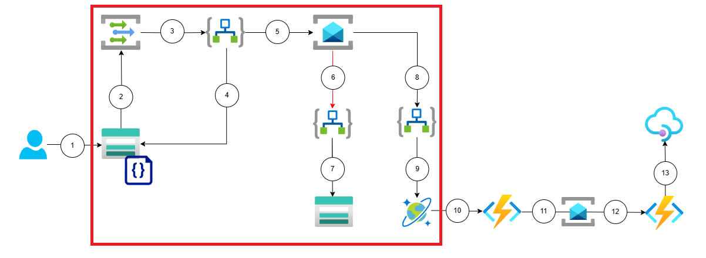
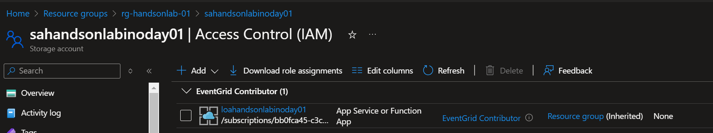
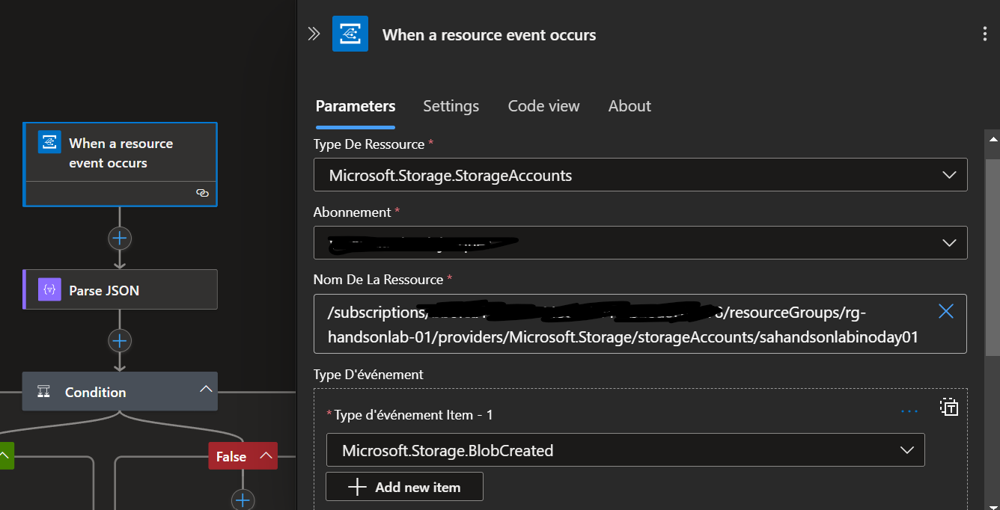
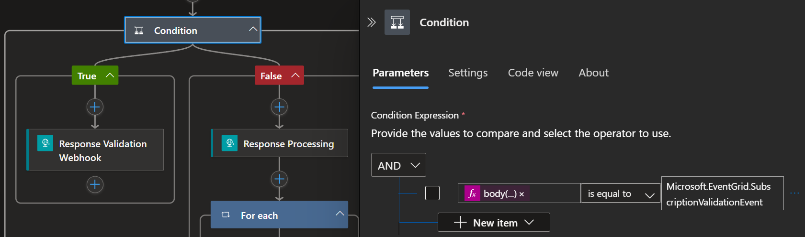
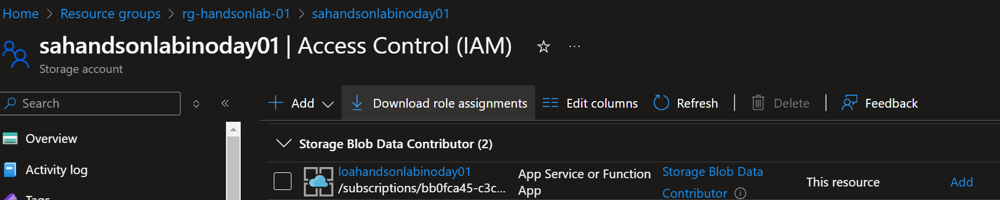
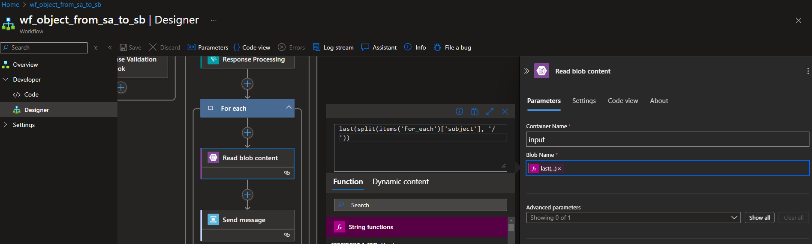

# 🚀 Lab 1 : Transform a JSON file (1 hour)

For this first lab, you will focus on the following scope :

## Detect a file upload event (15 min)

### Secure connections between Azure Services with Managed Identities

Managed Identities in Azure allow resources to authenticate securely to other Azure services. This feature eliminates the need to manage secrets or keys, reducing the risk of accidental exposure and simplifying maintenance. By enabling seamless and secure communication between resources, Managed Identities promote a stronger security model that relies on Azure's identity platform for authentication. 

You can find a detailed article which explains what are managed identities for Azure resources and how to use them [following this link](https://learn.microsoft.com/en-us/entra/identity/managed-identities-azure-resources/overview).

### Event Services

Serverless is all about designing the application around event-driven architectures. Azure offers several options when it comes to message and event brokering, with the principal following services :

- Event Grid is a serverless eventing bus that enables event-driven, reactive programming, using the publish-subscribe model.
- Service Bus is a fully managed enterprise message broker with message queues and publish/subscribe topics.
- Event Hub is a big data streaming platform and event ingestion service. It can receive and process millions of events per second.

> Each of these services offer their own set of capabilities and will be preferred depending on the expected architecture design and requirements. You can find a detailed article which compares the pros and cons of each of these solutions [following this link](https://learn.microsoft.com/en-us/azure/service-bus-messaging/compare-messaging-services). 

Event Grid is an event broker that you can use to integrate applications while subscribing to event sources. These events are delivered through Event Grid to subscribers such as applications, Azure services, or any accessible endpoint. Azure services, First and Third-party SaaS services as well as custom applications can be the source of these events.

### 🚀 Check Logic App permission to access Event Grid

Event Grid enables event-driven automation by reacting to changes in Azure resources, such as triggering workflows or functions when a blob is uploaded to Azure Blob Storage. This simplifies integration and real-time processing across services without constant polling. You will use it to trigger the Logic App workflow `xxx-xxx-xxx` when a blob is uploaded in the `input` container of the Storage Account.

The Logic App needs to access the Event Grid service through the Storage Account as it will create an Event Grid System Topic when the Event Grid trigger connector is created. Since we want to use Managed Identities to secure the connection between our Azure Resources, let's check how it is configured in the Storage Account.

> Check that correct RBAC configuration is applied in the Storage Account: 
>- Access the Storage Account `xxx-xxx-xxx`.
>- Go to Access Control (IAM).
>- Go to Role Assignment and check that Logic App `xxx-xxx-xxx` has the **Event Grid Contributor** role.

You should see the following RBAC configuration in your Storage Account :

### 🚀 Check the Event Grid trigger in Logic App

Next step is to actually trigger the Logic App `xxx-xxx-xxx` based on the event raised by your Event Grid System Topic when a file is uploaded to the `input` container.

Azure Logic Apps offers different components which can be used to define the steps of a flow as a chain of actions and controls. Here are the main ones :

- **Operations** : Triggers and Actions are the main building blocks of a Logic App. A trigger is the event that starts the workflow and an action is a step in this workflow.
- **Controls** : Switch, Loop, Condition, Scope are used to control the flow of the steps composing the actual logic of the workflow.
- **Connectors** : Connectors are used to connect to different first of third party services and applications. These connectors abstract the complexities of interacting with these services by defining their required and optional inputs as well as deserializing their outputs to dynamic objects usable in the rest of the flow steps.

Since we want the Logic App to be triggered when an event is pushed from the Event Grid System Topic, we will be using the Event Grid Built-In connector available in Logic App. It comes with one action "When a resource event occurs", that is triggered when an Azure Event Grid subscription fires an event.

> Check the configuration of the Event Grid trigger:   
>- Access the Logic App `xxx-xxx-xxx`. 
>- Open the workflow `wf_object_from_sa_to_sb` and the first trigger `When a resource event occurs`.
>- Make sure that the Resource Id corresponds to your Storage Account where the file will be uploaded and that the Event type is **Microsoft.Storage.BlobCreated**

You should see the following configuration in your trigger :

### 🚀 Check the Webhook validation condition

After the event is received, we add an action to parse the json event with the event grid schema. We can get the schema from [here](https://learn.microsoft.com/en-us/azure/event-grid/event-schema#event-schema). 
The input to Parse JSON step is :

`@triggerBody()`

We add a condition step after, to check whether the event is a subscription Validation event or not. Condition is: 

`"equals": [
          "@body('Parse_JSON')[0]?['eventType']",
          "Microsoft.EventGrid.SubscriptionValidationEvent"
        ]` 

The reason we need to do this is to validate that our workflow is the correct subscriber to the events in the Storage Account. This is a security mechanism, to avoid untrusted subscribers to your storage account. 
When we save the workflow for the first time, a subscription will be created in the storage account automatically with some default naming convention, but it will be in 'Creating' state. Until we do not validate this event, it will be in this state. 
To validate the event, we are using the Response action: `Response Validation Webhook`.

You should see the following configuration in your trigger :

## Process the event (10 min)

### 🚀 Check Logic App permission to access Storage Account

The Azure storage account is used to store data objects, including blobs, file shares, queues, tables, and disks. It is used to store the sample Json file inside an `input` container.

The Logic App needs to access the Storage Account to retrieve the sample Json file, and for the Event Grid trigger connector to list the available Storage Accounts in the Subscription. Since we want to use Managed Identities to secure the connection between our Azure Resources, let's check how it is configured in the Storage Account.

> Check that correct RBAC configuration is applied in the Storage Account: 
>- Access the Storage Account `xxx-xxx-xxx`.
>- Go to Access Control (IAM).
>- Go to Role Assignment and check that Logic App `xxx-xxx-xxx` has the **Storage Blob Data Contributor**.

You should see the following RBAC configuration in your Storage Account :

### 🚀 Retrieve file content

To retrieve the content of the file we will upload in the container `input`, we are using the `Read blob content` action.

> Vérifier comment l'action Blob Storage est configurée: 
>- This is an info admonition.
>- This is an info admonition.
>- This is an info admonition.

You should see the following configuration in your action :

## Publish the message (10 min)

### Pub/Sub integration pattern

Rappel sur le pattern d'intégration utilisé => what, why, how
Pub/Sub : Service Bus + Topic/Subscription

[Capture d'écran du pattern = si possible depuis site MS]

### 🚀 Check Logic App permission to access Service Bus

Explain here why we need to grant permission to SB (Managed Identity). 

> Vérifier que le RBAC est configuré dans le Service Bus. 
>- This is an info admonition.
>- This is an info admonition.
>- This is an info admonition.

[Capture d'écran RBAC Service Bus]

### 🚀 Publish the message to Service Bus

Check action in LOA to publish the message in the Service Bus Topic.

> Vérifier comment l'action Publish Message to SB est configurée: 
>- This is an info admonition.
>- This is an info admonition.
>- This is an info admonition.

[Capture d'écran de l'action Service Bus]

## Subscribe to the message (5 min)

2-3 lignes sur la partie souscription au message

### 🚀 Configure the Service Bus trigger in Logic App

> Expliquer comment configurer le trigger Service Bus: 
>- La connection existe déjà.
>- This is an info admonition.
>- This is an info admonition.

[Capture d'écran du trigger Service Bus]

## Transform the message (10 min)

### Message Transformation
Expliquer les différentes facon de transformer un message, et que c'est commun dans l'intégration.

### 🚀 Configure the transform action in Logic App

> Expliquer comment configurer l'action transform XML : 
>- Transform JSON to XML.
>- Transform XML using XSLT.
>- Transform XML to JSON.

[Capture d'écran de l'action transform]

## Store the message in Cosmos DB (10 min)

### 🚀 Retrieve Cosmos DB Shared Access Key

> Expliquer comment récupérer la Shared Access Key depuis CosmosDB : 
>- xxx
>- xxx
>- xxx

[Capture d'écran de la shared access key dans cosmosdb]

### 🚀 Configure the action in Logic App

> Expliquer comment configurer l'action create or update item in cdb : 
>- xxx
>- xxx
>- xxx

[Capture d'écran de l'action dans la Logic App]

## Store the message in Storage Account (5 min)

### 🚀 Configure the action in Logic App

Dire que le trigger est le même que dans l'autre logic app.

> Regarder l'action qui écrit dans le blob storage : 
>- xxx
>- xxx
>- xxx

[Capture d'écran de l'action dans la Logic App]